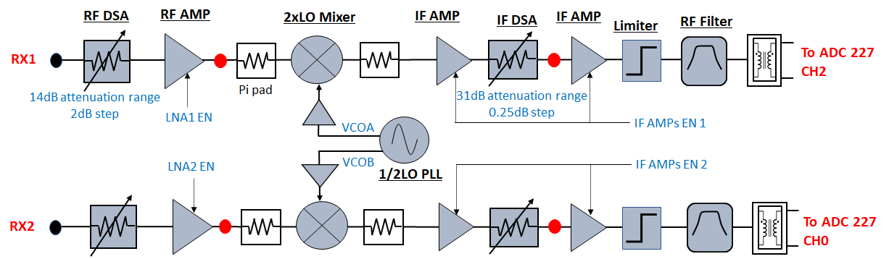
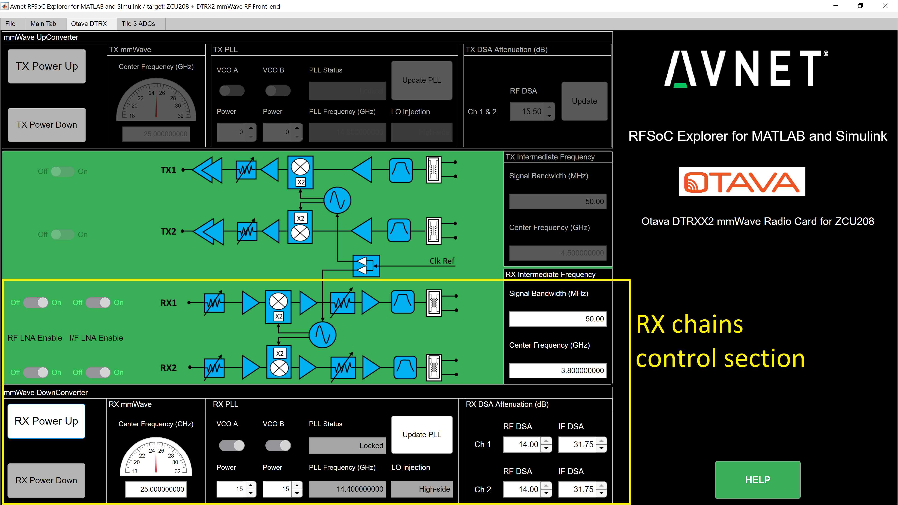
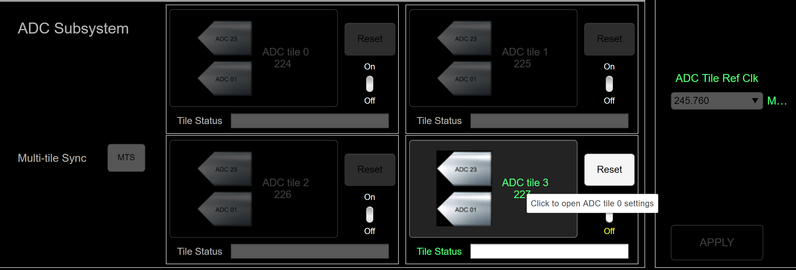
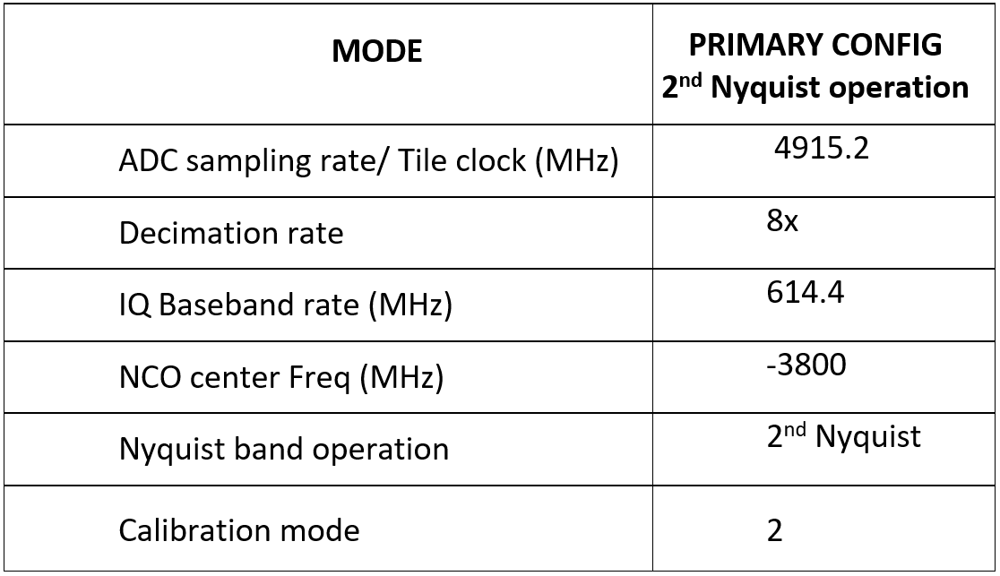
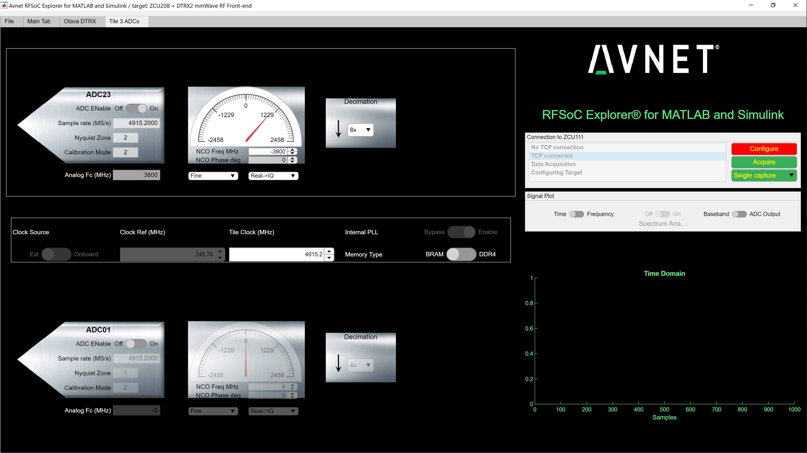
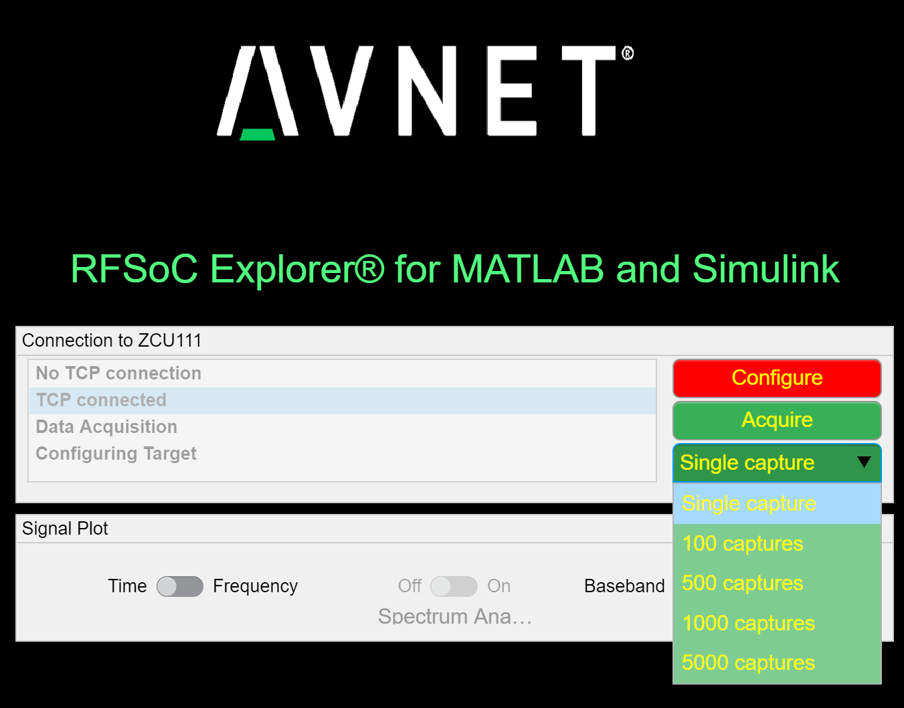
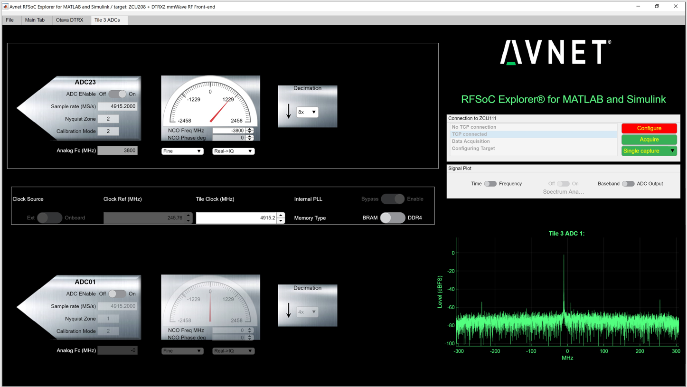
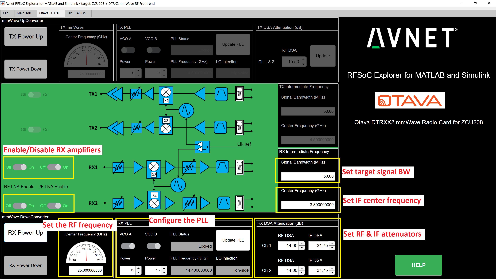
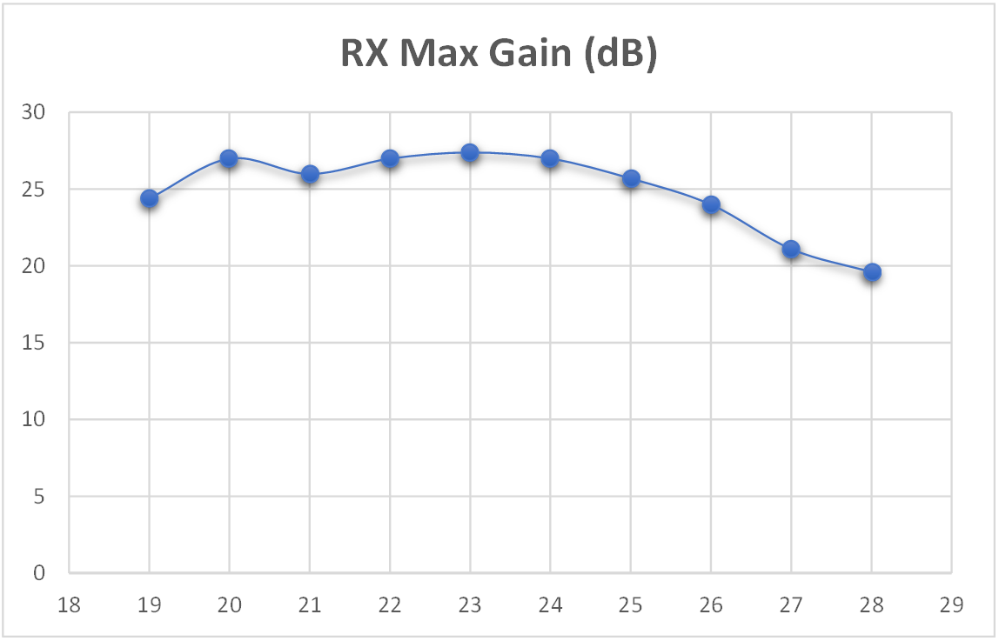

Receivers Configuration and Operation
====================================

In this procedure, we will go over the steps to program and configure the ZCU208+DTRX2 radio kit in **receive mode**. The DTRX2 card receivers will be run in their default states, operating at a default RF demodulation frequency of 25GHz.

The DTRX2 radio card signal chains
^^^^^^^^^^^^^^^^^^^^^^^^^^^^^^^^^^

The following diagram shows details of the RX signal chains of the DTRX2 card. 

The DTRX2 radio card implements 2 identical super-heterodyne RX chains, with their own dedicated PLL. 

The RX paths implement a wideband variable gain RF front-end with a coarse step attenuator at RF, ahead of the downconverting mixer, along with a wideband IF chain with fine step gain control as well.

It is also possible to enable/disable each of these signal paths individually via software, by control of the amplifiers power-down pins. 

Please note the specific ADCs tiles used on the RFSOC-Gen3 device shown in the diagram above. 

The RF band-select filter has been left out of this design to enable wideband RF coverage, but should be added to isolate the targeted sideband. This signal chain also doesn't include the front-end LNA, which may be connected externally.

The down converter mixers are 2xLO sub-harmonic passive mixers. Therefore, RX LO PLL device only needs to provide an LO signal at half the required frequency range. 
It is also possible, via software, and within the specified range, to change the IF center frequency to target better pass-band response or mixing spurious performance, depending on the operating RF frequency.

Each of these signal chains also have provisions for various RF access points (shown as red dots on the block diagram). Hardware modification is required to route the RF signals to these test points, by moving an AC coupling capacitor. These test points are not populated by default.

Power-up steps via the RFSOC Explorer tool
^^^^^^^^^^^^^^^^^^^^^^^^^^^^^^^^^^^^^^^^^^

Before powering up the RX chains, connect one of the RF inputs (RX1 or RX2 ports, labelled on the board) to a signal source, using a mmW-grade 2.92mm coaxial cable, and terminate the other one with a 50 ohms termination. 

Do not feed any RF signal until the RF chains have been powered up and the RFSOC ADCs have been configured, as described in the sections below. 

For the example described here, set the signal generator in CW mode, at 25.01GHz (for a 10MHz baseband frequency tone), and set the power level to -25dBm.

From the RFSOC Explorer application, go to the **“Otava DTRX”** tab in the RFSOC Explorer and click the **“RX Power up”** button on the bottom left of the page (see image below). This powers-up and performs a default configuration of the 2 receive channels. 

The average current drawn on the 12V supply should then be about **530mA**. 

By defaults, both RX channels should be ON, and in the following state:

-  The default RF center frequency is set to 25GHz and the RX PLL is programmed to an LO at 14.4GHz, for a default IF center frequency of 3.8GHz.
-	 The RX PLL visual lock indicator D2 should be lit (green LED on the DTRX2 card)
-	 Both RX channel 1 and channel 2 are enabled and powered
-	 Both Ch1 and Ch2 RF attenuators are set to **max attenuation** at -14dB for the mmW DSA and -31.75dB for the IF DSA

ZCU208 RFSOC ADC configuration and signal capture
^^^^^^^^^^^^^^^^^^^^^^^^^^^^^^^^^^^^^^^^^^^^^^^^^

#. In the RFSOC Explorer app, go back to the **Main Tab**
#. At the bottom right of the page, click the **ON** button for the ADC tile 3 227 and wait for the initialization to complete (may take 30 seconds)
#. Then click on the highlighted DAC icons after the prompt (shown below), which brings you to the ADC configuration page for both ADC23 and ADC01.

::

    ADC 23 digitizes the RX channel 1 of the DTRX2 card
    ADC 01 digitizes the RX channel 2 of the DTRX2 card

Let’s start with the ADC 23 and configure it as shown in this table:

::

    Make sure the ADC sampling rate or Tile Clock rate is set to 4915.2MHz. 

Then enter the IF or "NCO" RF frequency in MHz, and finally the decimation rate, as highlighted in the ADC23 white entry fields in the picture below:

Note that the internally programmed DDC demodulation frequency is shifted relative to the ADC sampling rate and Nyquist band used. In this particular example, it corresponds to Fs-IF = 1115.2MHz.  

The GUI software automatically selects the correct Nyquist band and Calibration mode based on the sampling rate and IF Frequency.

The user has the ability to also select between the BRAM and the DDR4 memory for data recording:

- Using the BRAM is convenient for fast captures and display, as it'll store up to 8k complex samples 

- For longer data captures, up to 32M complex samples, select DDR4 and reconfigure the ADC

For the initial bring-up, it is recommended to start in **BRAM** mode. Just toggle that switch before initiating the ADC configuration.

Then hit the **“Configure”** button, which runs the ADC configuration and calibration. 

The ADCs have to be calibrated with **NO active** RF signal at the receiver input (Make sure the signal generator RF output is still OFF when you hit the "Configure" button)

.. warning:: Do not inject an RF signal >-25dBm peak at the RX input ports, when both the RF and IF attenuators have been set to **minimum attenuation**!
 
Once the ADC has been calibrated (The "Configure" button will turn back green), go back to the DTRX board control page and set the CH1 RF and IF attenuators to -6dB each.

You may now turn ON the signal generator to perform signal captures. You may set its output level to -20dBm here since the receive chain has been set to Max gain -12dB total.

Back to the ADCs control tab (called "Tile3 ADCs"), hit either "single capture" or "multiple captures", as shown below.

The time domain data is stored in a local variable **“rx_sample_buffer”** as complex data and available from the Matlab workspace to be saved or post-processed. 

::

    Note that the "rx_sample_buffer" variable gets overwritten at each capture.

The signal captured is also shown on the graph, on the bottom right of the GUI window, either in the time domain or frequency domain. 

You may also use the **"Spectrum Analyzer" ON-OFF** button, in the Signal Plot section above the graph, to start the Matlab Spectrum analyzer display mode. This is convenient for adding markers, doing integrated power measurements etc...

At any time here, you may adjust the target RF frequency, the IF frequency, the target instantaneous bandwidth or the RF attenuator setting, as shown in the picture below. Also remember that after the RX chains have been powered up, all the RF/IF attenuators are set to max attenuation levels. 

The GUI software automatically calculates the PLL or VCO output frequency based on the wanted RF frequency and IF frequency. 
You’ll need to hit the **“Update PLL”** button every time you change the RF center frequency or the IF frequency or the targeted signal bandwidth, to program the PLL accordingly.

The **"Signal Bandwidth"** entry field is an estimate of the received signal bandwidth and doesn't need to be accurate.  It is mostly used to make sure the edges of the signal still fall within the availble IF pass-band, at a particular IF center frequency. 

Here's an example:
    - The DTRX2 IF frequency range of the receive paths is typically 3.2-4.4GHz
    - If the Signal BW = 50MHz, then the user may set the IF frequency anywhere between 3.225GHz and 4.375GHz
    - If the Signal BW = 400MHz, then the range of possible IF center frequencies is more restricted, within 3.4-4.2GHz 

For a received CW tone, you may leave this "Signal Bandwidth" parameter to the default value of 50MHz or set it as low as 1MHz. 

Finally, to enable or disable individual signal chains: use the ON/OFF buttons on the left of each illustrated signal chains. One button controls the RF amplifier and the other one control both IF amplifiers.

RX channels gain budget over RF frequency
^^^^^^^^^^^^^^^^^^^^^^^^^^^^^^^^^^^^^^^^^

Below is a graph showing the RX paths frequency response vs. RF frequency. 

As stated for the TX chains, the mixer runs in high-side injections until the LO PLL frequency reaches 15.3GHz. 

For a nominal IF frequency of 3.8GHz, this threshold is reached for RF = 26.8GHz. 
Beyond that RF frequency, the mixer runs with low-side injection.

It is important to note that the receivers have been intentionnally designed to be very wideband, hence providing mimimal frequency selectivity, at both RF and IF. 

The IF anti-alias filter has a pass-band greater than 1GHz. Therefore, depending on the target RF frequency of operation, the IF center frequency may be adjusted for best pass-band and spurious performance.

For instance, at RF frequencies below 20GHz, use higher IF values such at 4.2, 4.3GHz and high VCO power code (code = 25)
