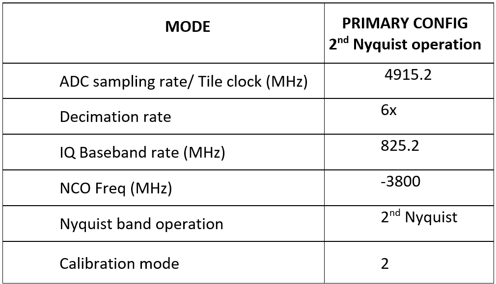

Receivers Configuration and Operation
====================================

In this procedure, we will power up and program the DTRX2 card receivers to their default states. The default RF demodulation frequency is 25GHz.

Before powering up the RX chains, connect one of the RF inputs (RX1 or RX2) to a signal source, using a mmW-grade 2.92mm coaxial cable, and terminate the other one with a 50 ohms termination. 

Do not feed any RF signal until the RF chains have been powered up and the RFSOC ADCs have been configured, as described in the sections below. 

For the example described here, set the signal generator in CW mode, at 25.01GHz (for a 10MHz baseband frequency tone), and set the power level to -35dBm.

From the RFSOC Explorer application, go to the **“Otava DTRX”** tab in the RFSOC Explorer and click the **“RX Power up”** button. This powers-up and performs a default configuration of the 2 receive channels. 

::

  ***INSERT PICTURE*** of the RFSOC Explorer DTRX2 page showing RX config section

The average current drawn on the 12V supply should then be about **530mA**. 

By defaults, both RX channels should be ON, and in the following state:

-   The default RF center frequency is set to 25GHz and the RX PLL is programmed to an LO at 14.4GHz, for a default IF center frequency of 3.8GHz.
-	The RX PLL visual lock indicator D2 should be lit (green LED on the DTRX2 card)
-	Both RX channel 1 and channel 2 are enabled and powered
-	Both Ch1 and Ch2 RF attenuators are set to **max attenuation** at -14dB for the mmW DSA and -31.75dB for the IF DSA

ZCU208 RFSOC ADC configuration and signal capture
^^^^^^^^^^^^^^^^^^^^^^^^^^^^^^^^^^^^^^^^^^^^^^^^^

#. In the RFSOC Explorer app, go back to the **Main Tab**
#. At the bottom right of the page, click the **ON** button for the ADC tile 3 227 and wait for the initialization to complete (may take 30 seconds)
#. Then click on the highlighted DAC icons after the prompt, which brings you to the ADC configuration page, shown below.

::

  ***INSERT PICTURE*** of the RFSOC Explorer ADC page as it should be set 

::

    ADC 23 digitizes the RX channel 1 of the DTRX2 card
    ADC 01 digitizes the RX channel 2 of the DTRX2 card

Let’s start with the ADC 23 and configure it as shown in this table:

See highlighted fields shown in the picture below:

::

  ***INSERT PICTURE*** of the RFSOC Explorer ADC page as it should be set for ADC23

Note that the GUI software will automatically select the correct Nyquist band and Calibration mode based on the sampling rate and NCO Frequency.

Make sure the ADC sampling rate or Tile Clock rate is set to 4951.2MHz.

The user has the ability to also select between the BRAM and the DDR4 memory for data recording:

- Using the BRAM is convenient for fast captures and display, as it'll store up to 8k complex samples 

- For longer data captures, up to 32M complex samples, select DDR4 and reconfigure the ADC

Then hit the **“Configure”** button, which runs the ADC configuration and calibration. 

The ADCs have to be calibrated with NO active RF signal at the receiver input (Make sure the signal generator RF output is still OFF)

.. warning:: Do not inject an RF signal >-25dBm at the RX input ports, when both the RF and IF attenuators have been set to max gain!
 
Once the ADC has been calibrated, turn the signal generator ON and hit either "single capture" or "multiple captures".

::

    ***Show*** drop-down menu for single or multiple captures

The data is stored in a local variable **“rx_sample_buffer”** as complex data and available from the Matlab workspace to be saved or post-processed. 

::

    Note that the "rx_sample_buffer" variable gets overwritten at each capture.

The signal captured is also shown on the graph, on the bottom right of the GUI window, either in the time domain or frequency domain. 

::

    ***INCLUDE EXAMPLE*** here where sig gen is set at -30dBm input, DTRX attenuators have been set to -6dB and show graph of captured FFT
    

You may also use the **"Spectrum Analyzer" ON-OFF** button, in the Signal Plot section above the graph, to start the Matlab Spretum analyzer application. This is convenient for adding markers, doing integrated power measurements etc...

::

    ***INSERT PICTURE*** to show that

At any time here, you may adjust the target RF frequency, the IF frequency, the target instantaneous bandwidth or the RF attenuator setting, as shown in the picture below:

.. image:: images_rx_setup/RFSOCX_DTRX2_RX_instructions1.png

Note that the GUI software automatically calculate the PLL output frequency based on the wanted RF frequency and IF frequency. 
You’ll need to hit the **“Update PLL”** button every time you change the RF, IF, BW frequencies to program the PLL accordingly.

RX channels gain budget over RF frequency
^^^^^^^^^^^^^^^^^^^^^^^^^^^^^^^^^^^^^^^^^

Below is a graph showing the RX paths frequency response vs. RF frequency. 

As stated for the TX chains, the mixer runs in high-side injections until the LO PLL frequency reaches 15.3GHz. 
For a nominal IF frequency of 3.8GHz, this threshold is reached for RF = 26.8GHz. 
Beyond that RF frequency, the mixer runs with low-side injection.

.. image:: images_rx_setup/RX_RF_Freq_response.png

It is important to note that the receivers have been intentionnally designed to be very wideband, hence providing mimimal frequency selectivity, at both RF and IF. 
The IF anti-alias filter has a pass-band greater than 1GHz. Therefore, depending on the target RF frequency of operation, the IF center frequency may be adjusted for best pass-band and spurious performance.

For instance, at RF frequencies below 20GHz, use higher IF values such at 4.2, 4.3GHz and high VCO power code (code = 25)
