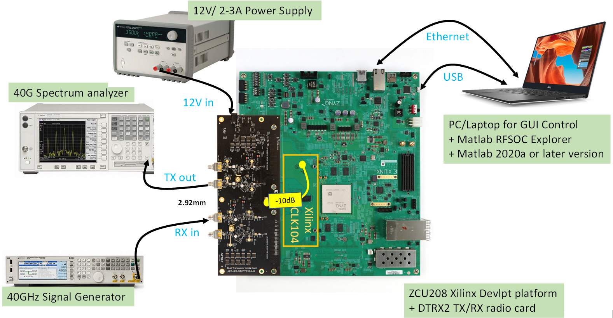
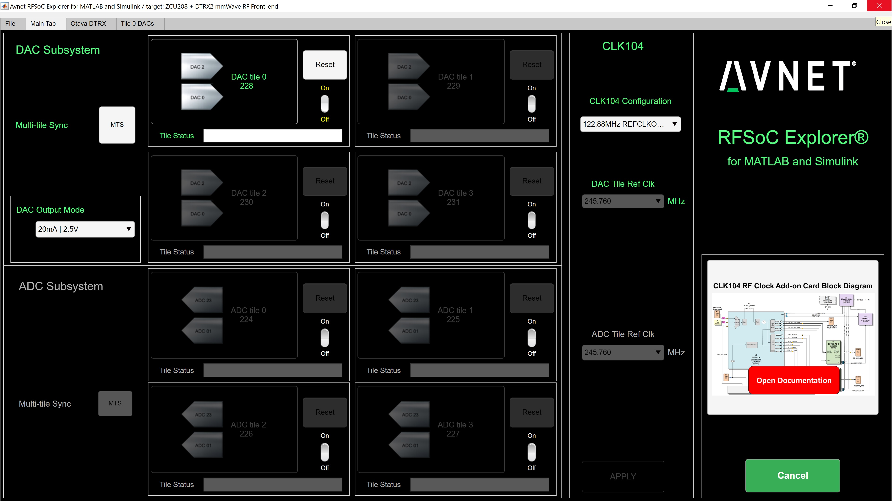

Introduction
-------------
This document will show you how to get started with the Avnet Wideband mmWave Radio Dev Kit for RFSoC Gen-3. Follow the step-by-step instructions to configure the kit, setup your computer, and use Avnet RFSoC Explorer® in MATLAB to generate and acquire signals through the Otava mmWave Dual Trancseiver RF Card.

.. image:: images_system_setup/zcu208_dtrx2_kit.png

Kit Overview
------------
The Avnet Wideband mmWave Radio Development Kit for RFSoC Gen-3 is ideal for prototyping RF applications in mmW bands including 5G NR FR2, wireless backhaul, as well as K/Ka band radar and SATCOM. This platform combines the Otava DTRX2 Dual Transceiver mmWave Radio Card — jointly developed by Otava and Avnet — with the Xilinx Zynq ® UltraScale+ ™ RFSoC ZCU208 Evaluation Kit.

.. warning:: This kit can radiate radio frequency energy and has not been tested for CE, FCC, or IC compliance. The intended use is for demonstration, engineering development, or evaluation purposes. See :ref:`compliance`

Install RFSoC Explorer
----------------------
Avnet RFSoC Explorer provides native connection to MATLAB ® and Simulink ®, featuring graphical control of the platform and intuitive APIs for programmatic access.

.. image:: images_system_setup/rfsocX-concept.jpg

You will need a computer running Windows 10 OS and the following MathWorks software. 

`Get a Free MATLAB Trial Package for RFSoC <https://www.mathworks.com/rfsoc>`_

   * MATLAB R2020b or later 
   * DSP System Toolbox
   * Fixed-Point Designer
   * Communications Toolbox
   * Communications Toolbox Support Package for Xilinx Zynq-Based Radio
   * Signal Processing Toolbox
   * LTE Toolbox (optional)
   * 5G Toolbox (optional)

RFSoC Explorer installs easily in the MATLAB APPS tab without modifying your registry or other applications.

1)	From **MATLAB > Add-Ons**, search for **Avnet RFSoC Explorer** and click install
2)	From **MATLAB > Add-Ons**, search for **Communications Toolbox Support Package for Xilinx Zynq-Based Radio** and click install
3) If prompted, click **Setup Later**

.. image:: images_system_setup/mw-addon.png

Hardware Setup
----------------
The Xilinx ZCU208 Evaluation Kit has many jumpers and switches that are shipped with default states, which do not need to change for this tutorial. In the following steps we describe the minimal configuration. For a comprehensive setup guide, refer to the online `Xilinx ZCU208 Quick Start Wiki <https://xilinx-wiki.atlassian.net/wiki/spaces/A/pages/569017820/RF+DC+Evaluation+Tool+for+ZCU208+board+-+Quick+Start>`_

.. image:: images_system_setup/hw-setup.jpg

#. First plug in the Xilinx CLK104 clock module onto the ZCU208 board

#.	Connect the ZCU208 to your host PC using both Ethernet cable and USB cable as shown in the picture 

#. Set the ZCU208 DIP switches (SW6) as shown in the figure below, which allows the ZCU208 board to boot from the SD card

.. image:: images_system_setup/zcu208-dip-sw.png

4) Then plug in the DTRX2 radio card to the ZCU208 card (2x board-to-board LPAM connectors on the bottom end of the DTRX2 card). Note that the LPAM connectors don’t snap to each other and the DTRX2 card needs to be secured by the 4 screws provided on both sides of the 2x high density LPAM connectors 

System Reference clocks
----------------------
The DTRX2 card needs an external 122.88MHz reference clock, used to lock the on-board mmW PLLs.

This signal may be generated by an external signal generator or directly from the CLK104 module on the ZCU208 board. 

The RFSOC Explorer tool allows programming the CLK104 module to generate a 122.88MHz LVPECL signal out of "OUTPUT_REF" SMA. Shown in the picture below.

On the other hand, the CLK104 module supports both an internal 10MHz reference clock (on-board TCXO) as well as an external 10MHz reference signal that may be taken from the back of a signal generator or a spectrum analyzer to synchronize the whole setup to a master clock. This external 10MHz reference signal is to be fed to the SMA #4 in the picture below (INPUT_REF_CLK)

.. image:: images_system_setup/CLK104.png

SD Card
-------
#. Remove the SD card from the ZCU208, insert into your PC, and format as FAT using a tool like `SD Memory Card Formatter <https://www.sdcard.org/downloads/formatter_4/>`_

#. Download the file **avnet_rfsocX_zcu111_boot_v1_0.zip** This archive contains the software for the ZCU111 evaluation board. Unzip the archive to a convenient location on your hard disk, then copy the files to the root level of the SD card. 

#. Safely eject the SD card from the PC and replace into ZCU208.

DTRX2 Hardware connections
--------------------------
At this point, the mmW radio card has only been attached to the ZCU208 platform.
Before power-up, you will need to:

#. Use one of the provided short SMA coax cables to connect the 122.88MHz reference clock signal on CLK104 module (J10 connector, labeled OUTPUT_REF)  to the DTRX2 input reference clock SMA (J21, labeled REF_CLK_IN). For reference clock spurious mitigation, it is recommended to also use a 10dB coaxial attenuator between the CLK104 output and the REF_CLK_IN input on the DTRX2 card, or a coaxial harmonic filter with a cut-off frequency above 150MHz.

#. Connect the RF input and output port (J3 or J6 for the TX chains, and J10, J15 for the RX chains) to the test equipment using a 2.92mm compatible mmW coaxial cable. 

#. Terminate the unused RF ports with a 2.92mm 50 ohms termination.

#. Finally, connect the DTRX2 to a 12V power supply using the DC cables provided. 

**Do not turn ON the power supply until the ZCU208 has finished booting.** (See next section of this document)

The following picture illustrates all these hardware connections:

Boot ZCU208
------------
#. Turn the ZCU208 power switch ON (near the 12V connector) 

#. The application auto-start function creates an IP connection for the board at address **169.254.10.2**. 

#. Set a static IP for your host PC's Local Ethernet adapter.  Make sure your PC and the board are on the same subnet and gateway. See example below.

.. image:: images_system_setup/network-cfg.png
.. image:: images_system_setup/laptop-ip.jpg

.. note:: The auto-start IP address can be changed in the autostart.sh file on your SD card. 

Starting the RFSOC Explorer software
------------------------------------

NEED TO UPDATE CONTENT + PICS

Open Matlab and run the RFSOC Explorer application using the command below in the Matlab command window:

**rfsocX = Avnet_RFSoC_Explorer(‘target board’, 4);**

This will open this application window 

On the Main tab, enter the IP address of the ZCU208 and check connection.

Then configure the CLK104 Reference clock using the drop-down menu “CLK104 Configuration” on the top right area of the main page. 
Select the configuration file that refers to the on-board 10MHz TCXO reference, to generate a “stand-alone” 122.88MHz clock signal to the DTRX2: Configuration called **‘122.88MHz REFCLKOUT_10MHz TCXO REF’**

If you wish to synchronize the setup up to a test instrument 10MHz clock, a configuration file is also provided, called **‘122.88MHz REFCLKOUT_10MHz EXT REF’** . This will be useful for EVM measurements.  

As mentioned earlier, make sure you've connected signal path under test to either the spectrum analyzer for TX chain measurements or to the signal generator for RX chain evaluations. 

**Again, all the unused channels should be terminated with a 2.92mm 50 ohms termination.**

You may now turn ON the 12V DC power to the DTRX2 card. Both D4 and D6 LED should be lit (Red color)

The idle current drawn off the 12V supply should be about 45mA.

.. _compliance:

Regulatory Compliance Information
-----------------------------------
This kit can radiate radio frequency energy and has not been tested for CE, FCC, or IC compliance. The intended use is for demonstration, engineering development, or evaluation purposes.

FCC WARNING
^^^^^^^^^^^
This kit is designed to allow:
 
(1) Product developers to evaluate electronic components, circuitry, or software associated with the kit to determine whether to incorporate such items in a finished product and
 
(2) Software developers to write software applications for use with the end product. 

This kit is not a finished product and when assembled may not be resold or otherwise marketed unless all required FCC equipment authorizations are first obtained. Operation is subject to the condition that this product not cause harmful interference to licensed radio stations and that this product accept harmful interference. Use of the kit should be limited to a development lab environment only.

CE WARNING
^^^^^^^^^^
This evaluation kit is for use by professionals for their research and development purposes. The kit may not be put into service for use on a regular basis, or integrated into an end product (Annex I.4 of the RED). This kit is does not bare the CE mark of certification. As such, this kit may be operated only within the requirements of RED section 1.6.2.5, Custom-built evaluation kits.

