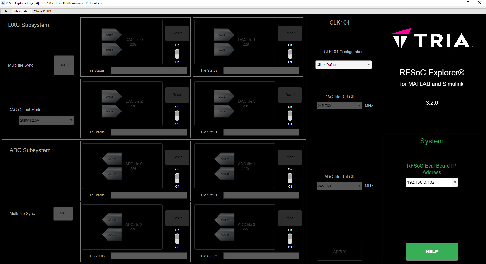

System Setup
============

This document will show you how to get started with the `Avnet Wideband mmWave Radio Development Kit for RFSoC Gen-3 <https://www.avnet.com/rfsoc-mmw>`_. Follow the step-by-step instructions to assemble the kit, setup your computer, and use Avnet RFSoC Explorer® in MATLAB to configure the Otava DTRX2 Dual Transceiver mmWave Radio Card, generate and acquire signals.

.. image:: images_system_setup/zcu208_dtrx2_kit.png

Kit Overview
------------
The Avnet Wideband mmWave Radio Development Kit for RFSoC Gen-3 is ideal for prototyping RF applications in mmW bands including 5G NR FR2, wireless backhaul, as well as K/Ka band radar and SATCOM. This platform combines the Otava DTRX2 Dual Transceiver mmWave Radio Card — jointly developed by Otava and Avnet — with the Xilinx Zynq ® UltraScale+ ™ RFSoC ZCU208 Evaluation Kit.

.. warning:: This kit can radiate radio frequency energy and has not been tested for CE, FCC, or IC compliance. The intended use is for demonstration, engineering development, or evaluation purposes. See :doc:`Regulatory Compliance Information <./compliance>`

Kit Includes
^^^^^^^^^^^^
* Xilinx Zynq UltraScale+ RFSoC ZCU208 Evaluation Kit (full OEM kit)
* Otava DTRX2 mmWave Radio Daughtercard
* DC barrel jack to banana plug cable for DTRX2
* Avnet RFSoC Explorer for MATLAB and Simulink

Required Equipment
------------------
In addition to the mmWave kit, you will need the following.

* Laptop or PC running Windows 10 OS
* Bench power supply for 12V, 2A min 
* 40GHz Spectrum analyzer for Transmitter tests
* 40GHz Signal generator for Receiver tests
* 1x or more RF coaxial cables (2.92mm to 2.92 or 2.4mm on test equipment)
* 3x 2.92mm male 50-ohm terminations (rated for 40GHz, 0.5W or higher)
* 1x RF SMA coax cable to connect the CLK104 Reference Clock (in the kit)
* 1x 10dB SMA coaxial attenuator or low-pass filter (for DTRX2 Ref clock input port)
* Optional – n258, n257, n260 band-pass filters
* 12V jack to banana plug DC electrical wires (in the kit)

Install RFSoC Explorer
----------------------
Avnet RFSoC Explorer provides native connection to MATLAB ® and Simulink ®, featuring graphical control of the platform and intuitive APIs for programmatic access.

Your computer will need the following MathWorks software. 

* MATLAB (`supported versions <https://www.mathworks.com/matlabcentral/fileexchange/73665-avnet-rfsoc-explorer>`_)
* DSP System Toolbox
* Fixed-Point Designer
* Communications Toolbox
* Signal Processing Toolbox
* Install one of the following support packages from the MATLAB Add-On Manager
  
    * Communications Toolbox Support Package for Xilinx Zynq-Based Radio
    * HDL Coder Support Package for Xilinx RFSoC Devices
    * HDL Coder Support Package for Xilinx Zynq Platform
    * SoC Blockset Support Package for Xilinx Devices

Optional toolboxes for working with standards-compliant waveforms in RFSoC Explorer

* LTE Toolbox (optional)
* 5G Toolbox (optional)

`Get a Free MATLAB Trial Package for RFSoC <https://www.mathworks.com/rfsoc>`_

RFSoC Explorer installs easily using the MATLAB Add-Ons store.

1)	From **MATLAB > Add-Ons**, search for **Avnet RFSoC Explorer** and click install
2)	From **MATLAB > Add-Ons**, search for **Communications Toolbox Support Package for Xilinx Zynq-Based Radio** and click install
3) If prompted, click **Setup Later**

.. image:: images_system_setup/mw-addon.png

Hardware Setup
----------------
The Xilinx ZCU208 Evaluation Kit has many jumpers and switches that are shipped with default states, which do not need to change for this tutorial. In the following steps we describe the minimal configuration. For a comprehensive setup guide, refer to the `ZCU208 Software Install and Board Setup <https://www.xilinx.com/support/documentation/boards_and_kits/zcu208/2020_1/xtp607-zcu208-setup-c-2020-1.pdf>`_

.. image:: images_system_setup/hw-setup.jpg

**Refer to the diagram above when making the following connections.**

#. Connect the Xilinx CLK104 module to the ZCU208 with the included screws
#. Connect the Otava DTRX2 mmWave Card to the ZCU208 with the included screws
#. Connect the ZCU208 to your PC with Ethernet and USB cables. *USB is optional for terminal access to Linux running on the board.*
#. **DO NOT CONNECT POWER TO THE DTRX2 CARD** (this will be done later)
#. Use one of the provided SMA cables from the ZCU208 kit to connect **CLK104** OUTPUT_REF (J10) to **DTRX2** REF CLK IN (J21). 

.. note:: For reference clock spurious mitigation, we recommend a 10dB coaxial attenuator, or a low-pass filter (with >122.88MHz cutoff) between the CLK104 output and the REF_CLK_IN input on the DTRX2 card

6. Connect DTRX2 RF inputs/outputs to test equipment using 2.92mm mmW coaxial cables

   * TX outputs @ J3 (Ch1) and J6 (Ch2)
   * RX inputs @ J10 (Ch1) and J15 (Ch2)

.. warning:: All unused RF channels input/output connectors on the DTRX2 radio card must be terminated with 50 ohms 2.92mm terminations.

7. Set ZCU208 to boot from the SD card by setting (SW6) switches as shown below

.. image:: images_system_setup/zcu208-dip-sw.png

Prepare SD Card
---------------
The ZCU208 requires custom software to control DTRX2 card via RFSoC Explorer.

1. Remove the SD card from the ZCU208, insert into your PC, and format as FAT using a tool like `SD Memory Card Formatter <https://www.sdcard.org/downloads/formatter_4/>`_

2. Use one of the links below to download the SD boot image archive, depending on the version of zcu208 you are using.
   
    * ZCU208 ES1 SD Card Image - `avnet_rfsocX_zcu208es1_boot_v1_0.zip <https://avnet.me/rfsocX_zcu208es1_boot_v1_0>`_
    * ZCU208 Production SD Card Image - `avnet_rfsocX_zcu208_boot_v1_0.zip <https://avnet.me/rfsocX_zcu208_boot_v1_0>`_

3. Unzip the archive to the root level of the SD card

4. Safely eject the SD card from the PC and replace in the ZCU208

Boot & Network Configuration
----------------------------
The default way to connect to the board is by setting a static IP address on your host PC. We also include instructions for connecting the board to a networked router and allowing the board to use DHCP to obtain an IP address.

DHCP IP (default)
^^^^^^^^^^^^^^^^^^
Use this method when connecting the ZCU208 to your PC using a network (via Ethernet router for instance). You will need a USB cable connected to the mini-USB port on the ZCU208 board and your PC.

1. Open a serial terminal emulator (e.g. TeraTerm) on your PC.

.. note:: For help installing the ZCU208 USB-UART driver and setting up a serial terminal emulator, consult `ZCU208 Software Install and Board Setup <https://www.xilinx.com/support/documentation/boards_and_kits/zcu208/2020_1/xtp607-zcu208-setup-c-2020-1.pdf>`_

2. Turn the ZCU208 power switch ON (near the 12V connector)
#. Login into the ZCU208 as ``login: root  Password: root``
#. Discover the board IP address using the command ``ifconfig``. 
   **Take note of this IP address** You will use it in the next section to connect RFSoC Explorer.

.. image:: images_system_setup/ifconfig.jpg

Static IP
^^^^^^^^^^
Use this method when connecting the ZCU208 directly to your PC.

1. Ensure that the ZCU208 power switch is OFF (near the 12V connector)
#. Remove the SD card from the ZCU208 and insert into your PC
#. Open the **autostart.sh** file in a test editor. Set ``USE_DHCP=false``

::

    # Set true if your network assigns an IP address via DHCP
    # Set false for static IP address
    USE_DHCP=false

4. Safely eject the SD card from the PC and replace into ZCU208

#. Turn the ZCU208 power switch ON

#. The application auto-start function creates an IP connection for the board at address **169.254.10.2** To use a different IP address, simply modify the ``IPADDR`` field in the autostart.sh file.

::

    # Static IP address (you can set to this to whatever works for you)
    IPADDR="169.254.10.2"

7. Set a static IP for your host PC's Local Ethernet adapter.  Make sure your PC and the board are on the same subnet and gateway. See example below

Start RFSoC Explorer
--------------------

#. Open MATLAB and start RFSoC Explorer by entering the following command: 

   ``rfx = Avnet_RFSoC_Explorer(‘target_board’, 4);``

2. On the Main tab, under "System", enter the IP address of the ZCU208 -- default addess: **169.254.10.2**. Upon hitting the Enter key, a "GOOD" status should be reported next to it, confirming a successful communication link.

.. image:: images_system_setup/rfsocX_ipaddress.jpg
    :scale: 75%
    :align: center

.. note:: You may need to maximize the RFSoC Explorer window to reveal the IP Address dropdown

Configure System Reference Clocks
----------------------------------
The CLK104 module provides an ultra low-noise, wideband RF clock source for the ZCU208 RF-ADCs and RF-DACs. We use the RFSoC Explorer to configure CLK104 to ouptut a coherent 122.88MHz reference for the DTRX2 LO PLLs. For more information refer to `Xilinx UG1437 - CLK104 RF Clock Add-onCard <https://www.xilinx.com/support/documentation/boards_and_kits/zcu216/ug1437-clk104.pdf>`_

The following picture shows the details of the CLK104 module. The bottom SMA is the 122.88MHz reference clock output to be connected to the DTRX2 input reference clock port. And the other SMA connector above, labelled "INPUT_REF_CLK" is a provision for an external 10MHz master reference clock signal (used for synchronization with test equipments for instance).  
When an external 10MHz is not provided, the CLK104 module needs to be configured to use the internal 10MHz TCXO, as decribed in the steps below.

.. figure:: images_system_setup/CLK104.png
    :align: center

    Xilinx CLK104 System Clock Module

#. Go to the RFSoC Explorer Main tab
#. Select **CLK104 Configuration > 122.88MHz REFCLKOUT_10MHz TCXO REF**

.. image:: images_system_setup/clk104_config.jpg
    :scale: 75%

.. note:: The **122.88MHz REFCLKOUT_10MHz TCXO REF** configuration points to the register configuration file for the LMK04828 clock distribution chip on the CLK104 module. This particular file sets the LMK04828 to take the on-board 10MHz TCXO for reference clock signal. If you wish to synchronize the setup up to a test instrument 10MHz output reference, connect this port to the CLK104 SMA labelled "INPUT_REF_CLK" and use the **122.88MHz REFCLKOUT_10MHz EXT REF** configuration (typically recommended for demodulation and for EVM measurements). On the other end, for best EVM performance, and because of the limited amplitude level out of J10 on the CLK104 module, consider a clean external source to generate the 122.88MHz clock reference to the DTRX2. Finally, the tool also allows for a custom configuration file to be loaded as well (saved as a .txt file and to be located in the same directory as the RFSOC Explorer app). 

Power Up DTRX2
---------------
#. Connect your test equipment to the DTRX2 RF and TX ports
#. Terminate unused channels with a 2.92mm 50 ohms termination
#. Apply 12V DC power to the DTRX2 card, using the DC barrel jack-to-banana plugs cable provided.

Both D4 and D6 "Power Good" red LEDs should be ON. The idle current drawn from the 12V supply should be about 45mA.

In the next sections you will power up the TX and RX signal chains using RFSoC Explorer and observe the green RX PLL LOCK and TX PLL LOCK LEDs turn ON, as shown in this image.

Click NEXT to setup the DTRX2 transmit chains.