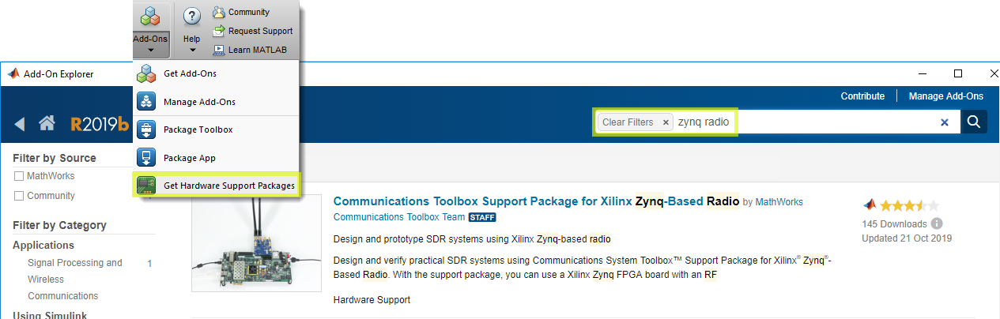

Introduction
-------------
This document will show you how to get started with the Avnet Wideband mmWave Radio Dev Kit for RFSoC Gen-3. Follow the step-by-step instructions to configure the kit, setup your computer, and use Avnet RFSoC Explorer® in MATLAB to generate and acquire signals through the Otava mmWave Dual Trancseiver RF Card.

.. image:: images_system_setup/zcu208_dtrx2_kit.png

Kit Overview
------------
The Avnet Wideband mmWave Radio Development Kit for RFSoC Gen-3 is ideal for prototyping RF applications in mmW bands including 5G NR FR2, wireless backhaul, as well as K/Ka band radar and SATCOM. This platform combines the Otava DTRX2 Dual Transceiver mmWave Radio Card — jointly developed by Otava and Avnet — with the Xilinx Zynq ® UltraScale+ ™ RFSoC ZCU208 Evaluation Kit.

.. warning:: This kit can radiate radio frequency energy and has not been tested for CE, FCC, or IC compliance. The intended use is for demonstration, engineering development, or evaluation purposes. See :ref:`compliance`

Required Equipment
------------------
In addition to the mmWave kit, you will need the following.

* Laptop or PC running Windows 10 OS
* Bench power supply for 12V, 2A min 
* 40GHz Spectrum analyzer for Transmitter tests
* 40GHz Signal generator for Receiver tests

Install RFSoC Explorer
----------------------
Avnet RFSoC Explorer provides native connection to MATLAB ® and Simulink ®, featuring graphical control of the platform and intuitive APIs for programmatic access.

.. image:: images_system_setup/rfsocX-concept.jpg

Your computer will need the following MathWorks software. 

* MATLAB R2020b or later 
* DSP System Toolbox
* Fixed-Point Designer
* Communications Toolbox
* Communications Toolbox Support Package for Xilinx Zynq-Based Radio
* Signal Processing Toolbox
* LTE Toolbox (optional)
* 5G Toolbox (optional)

`Get a Free MATLAB Trial Package for RFSoC <https://www.mathworks.com/rfsoc>`_

RFSoC Explorer installs easily using the MATLAB Add-Ons store.

1)	From **MATLAB > Add-Ons**, search for **Avnet RFSoC Explorer** and click install
2)	From **MATLAB > Add-Ons**, search for **Communications Toolbox Support Package for Xilinx Zynq-Based Radio** and click install
3) If prompted, click **Setup Later**

Hardware Setup
----------------
The Xilinx ZCU208 Evaluation Kit has many jumpers and switches that are shipped with default states, which do not need to change for this tutorial. In the following steps we describe the minimal configuration. For a comprehensive setup guide, refer to the online `Xilinx ZCU208 Quick Start Wiki <https://xilinx-wiki.atlassian.net/wiki/spaces/A/pages/569017820/RF+DC+Evaluation+Tool+for+ZCU208+board+-+Quick+Start>`_

.. image:: images_system_setup/hw-setup.jpg

#. Connect the Otava DTRX2 mmWave Card, the ZCU208, and cables as shown in the picture
#. Use the inlcuded screws to attach the CLK104 and DTRX2 cards to the ZCU208 base board
#. Plug Ethernet and USB cables into your host PC
#. **DO NOT CONNECT POWER TO THE DTRX2 CARD** (this will be done later)
#. Use a Carlisle SMA cable from the ZCU208 kit to connect the CLK104 OUTPUT_REF (J10) to the DTRX2 REF CLK IN (J21). 

.. note:: For reference clock spurious mitigation, it is recommended to also use a 10dB coaxial attenuator between the CLK104 output and the REF_CLK_IN input on the DTRX2 card

6. Connect DTRX2 RF inputs/outputs to test equipment using 2.92mm mmW coaxial cables

* TX output @ J3 (Ch1) and J6 (Ch2)
* RX input @ J10 (Ch1) and J15 (Ch2)

.. note:: All unused channels on DTRX2 must be connected to 50 ohm terminations.

7. Set ZCU208 to boot from the SD card by setting (SW6) switches as shown below

.. image:: images_system_setup/zcu208-dip-sw.png

SD Card
-------
#. Remove the SD card from the ZCU208, insert into your PC, and format as FAT using a tool like `SD Memory Card Formatter <https://www.sdcard.org/downloads/formatter_4/>`_

#. Download the file **avnet_rfsocX_zcu111_boot_v1_0.zip** This archive contains the software for the ZCU111 evaluation board. Unzip the archive to a convenient location on your hard disk, then copy the files to the root level of the SD card. 

#. Safely eject the SD card from the PC and replace into ZCU208.

Boot ZCU208
------------
#. Ensure no power is applied to DTRX2

#. Turn the ZCU208 power switch ON (near the 12V connector) 

#. The application auto-start function creates an IP connection for the board at address **169.254.10.2**. 

#. Set a static IP for your host PC's Local Ethernet adapter.  Make sure your PC and the board are on the same subnet and gateway. See example below.

.. image:: images_system_setup/network-cfg.png
.. image:: images_system_setup/laptop-ip.jpg

.. note:: The auto-start IP address can be changed in the autostart.sh file on your SD card. 

.. _compliance:

Regulatory Compliance Information
-----------------------------------
This kit can radiate radio frequency energy and has not been tested for CE, FCC, or IC compliance. The intended use is for demonstration, engineering development, or evaluation purposes.

FCC WARNING
^^^^^^^^^^^
This kit is designed to allow:
 
(1) Product developers to evaluate electronic components, circuitry, or software associated with the kit to determine whether to incorporate such items in a finished product and
 
(2) Software developers to write software applications for use with the end product. 

This kit is not a finished product and when assembled may not be resold or otherwise marketed unless all required FCC equipment authorizations are first obtained. Operation is subject to the condition that this product not cause harmful interference to licensed radio stations and that this product accept harmful interference. Use of the kit should be limited to a development lab environment only.

CE WARNING
^^^^^^^^^^
This evaluation kit is for use by professionals for their research and development purposes. The kit may not be put into service for use on a regular basis, or integrated into an end product (Annex I.4 of the RED). This kit is does not bare the CE mark of certification. As such, this kit may be operated only within the requirements of RED section 1.6.2.5, Custom-built evaluation kits.

