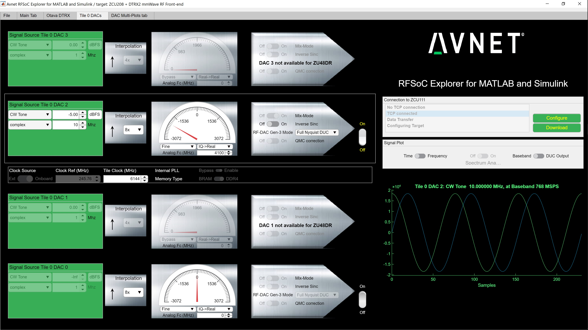
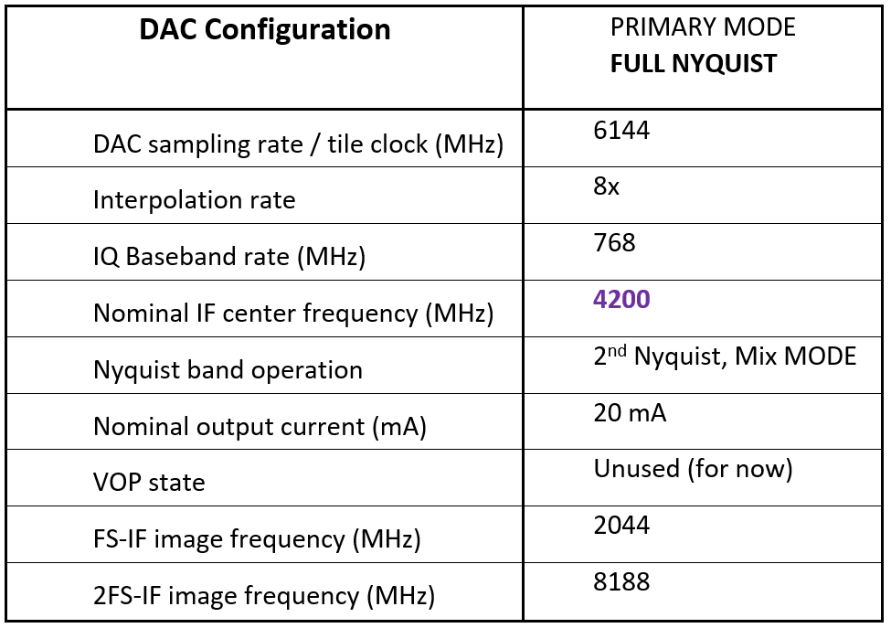

Transmitter Configuration and operation
---------------------------------------
In this procedure, we will run the transmitters to the default mmW output frequency of 25GHz. 
Set the spectrum analyzer center frequency to 25GHz then, to observe the signal transmitted after power up.
From the RFSOC Explorer application, go to the “Otava DTRX” tab and hit the **“TX Power up”** button. This powers-up both TX channels and performs a default configuration of the 2 RF transmit channels.

**Insert picture of the RFSOC Explorer DTRX2 page**

The average current drawn on the 12V supply should then be about 760mA. 

By defaults, both TX channels should be ON, and in the following state:
-	The default RF frequency is 25GHz and the TX PLL is programmed to an LO at 14.6GHz, for a default IF frequency of 4.2GHz.
-	The TX PLL visual lock indicator D2 should be lit (green LED)
-	Both TX channel 1 and channel 2 are enabled and powered
-	Both Ch1 and Ch2 RF attenuators are set to max attenuation at -15.5dB

ZCU208 RFSOC DAC configuration and signal generation
^^^^^^^^^^^^^^^^^^^^^^^^^^^^^^^^^^^^^^^^^^^^^^^^^^^^
#. Go back to the main tab of the RFSOC Explorer tool
#. Hit the ON button for the DAC tile 0 228 and wait for the initialization to complete (may take 30 seconds)
#. Then click on the highlighted DAC icons after the prompt, which brings you to the DAC configuration page, shown below.

**Tile 0 DAC 2 drives the TX channel 1 of the DTRX2 card.**

**Tile 0 DAC 0 drives the TX channel 2 of the DTRX2 card.**

Let’s start with the DAC2 and configure it as shown in this table:

#. Check that the Tile clock (DAC sampling rate) is set to 6144MHz (DAC sampling rate)
#. Click on the ON button on the right 
#. Enter the IF frequency of operation in the "Analog Fc(MHz)" field: here 4200MHz, which will also be used to set the RFSOC DUC NCO frequency based on the sampling rate  
#. Enter the interpolation rate: 8x
#. Now to send a CW tone: in the Signal Source section, set the sinewave frequency and its level relative to full scale. In this example, we’ll use a 10MHz baseband tone at -5dBFS
#. The Configure button on the right should be highlighted in red, signaling that you need to configure the DAC before being able to download the waveform to the RFSOC. So hit the “Configure” button, then hit download, after the configuration is complete. You should see a display of the I and Q waveform in the graph below, on the GUI DAC page.

Note that you may also display the frequency domain response of the signal being loaded by toggling the **Time-Frequency** button above the graph.
This user interface also models the expected signal post DUC or post interpolating FIR filter: toggle the **Baseband-DUC** output button

With the DAC output IF frequency set at 4.2GHz, and the TX LO PLL running at 14.6GHz, the mixer generates 2 sidebands, including the wanted signal at 25GHz. Some amount of LO leakage also leaks out at 2x LO or 29.2GHz. See below the major output tones out of the transmit chain (2x multiplication inside the mixer LO chain)

**Add picture of the expected major tones**
