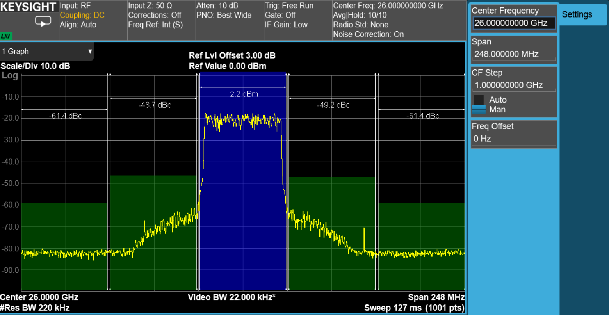
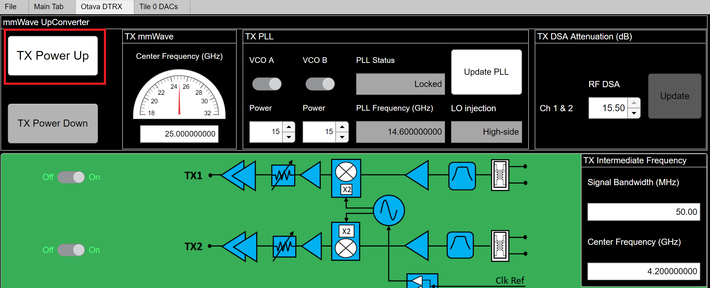
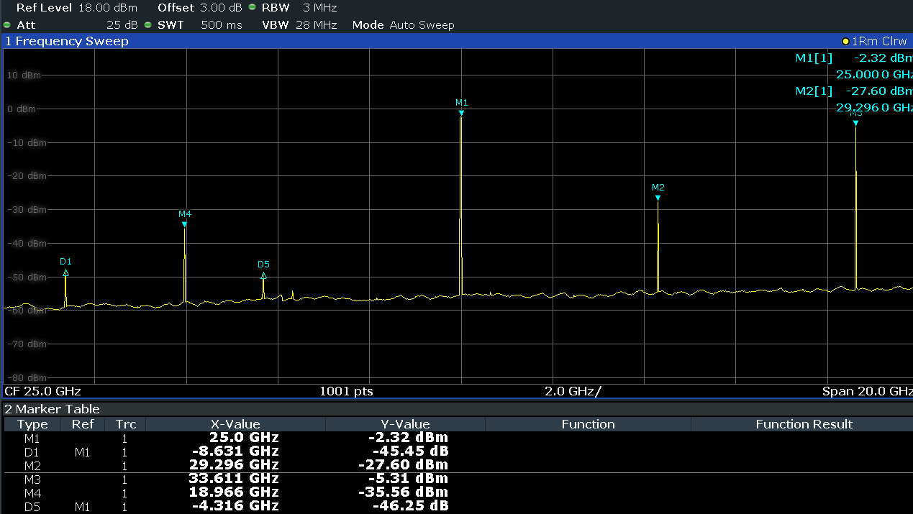
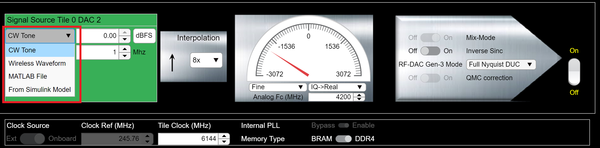
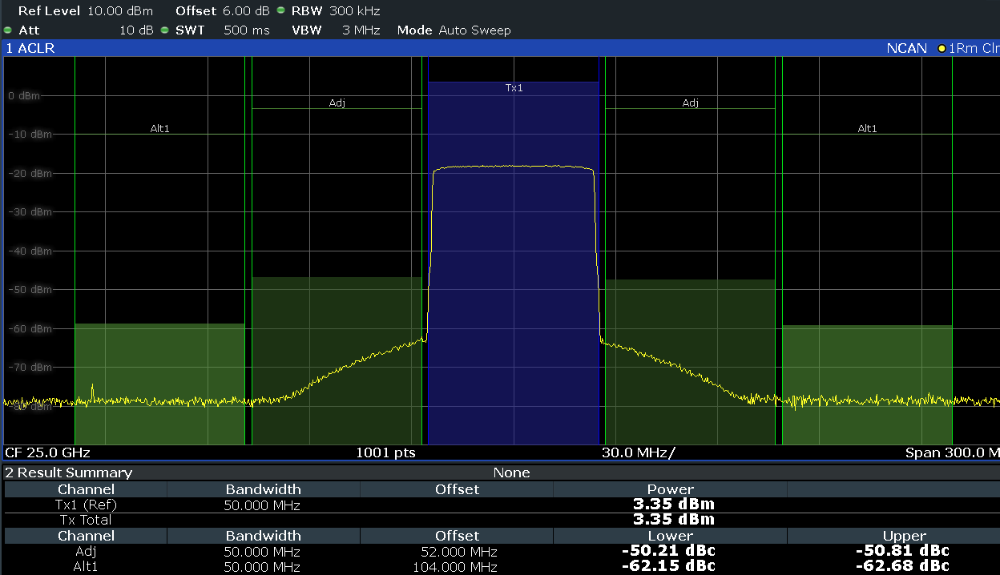

Transmitter Configuration and Operation
=======================================

<<<<<<< HEAD
Section 1
^^^^^^^^^

=======
In this procedure, we will go over the steps to program and configure the ZCU208+DTRX2 radio kit in **transmit mode**. The DTRX2 card transmitters will be run in their default states, operating at a default RF modulation frequency of 25GHz.

The DTRX2 radio card transmit signal chains
----------------------------------

The following diagram shows details of the TX signal chains of the DTRX2 card. 

.. image:: images_tx_setup/TX_Signal_chains _rev1.png

The DTRX2 radio card implements 2 identical super-heterodyne TX chains, with their own dedicated PLL. 

The TX paths implement a wideband variable gain RF front-end with a 15.5dB range, 0.5dB step RF attenuator.

It is also possible to enable/disable each of these signal paths individually via software, by control of the amplifiers power-down pins. 

Please note the specific DAC tiles used on the RFSOC-Gen3 device shown in the diagram above. 

The RF band-select filter has been left out of this design to enable wideband RF coverage, but should be added to isolate the targeted sideband. 

The up-converter mixers are 2xLO sub-harmonic passive mixers. Therefore, TX LO PLL device only needs to provide an LO signal at half the required frequency range. 
It is also possible, via software, and within the specified range, to change the IF center frequency to target better pass-band response or mixing spurious performance, depending on the operating RF frequency.

Each of these signal chains also have provisions for various RF access points (shown as red dots on the block diagram). Hardware modification is required to route the RF signals to these test points, by moving an AC coupling capacitor. These test points are not populated by default.

Power-up steps via the RFSOC Explorer tool
------------------------------------------

Before powering up the radio, set the spectrum analyzer center frequency to 25GHz to observe the signal transmitted. 

From the RFSOC Explorer application, go to the “Otava DTRX” tab and hit the **“TX Power up”** button (as highlighted in red box below). This powers-up both TX channels and performs a default configuration of the 2 RF transmit channels. The following picture shows the TX channels power-up states.

The average current drawn on the 12V supply should then be about 760mA. 

By defaults, both TX channels should be ON, and in the following state:

-	Both TX channel 1 and channel 2 are enabled and powered up
-	The default RF frequency is 25GHz and the TX PLL is programmed to an LO at 14.6GHz, for a default IF frequency of 4.2GHz.
-	The TX PLL visual lock indicator (LED D2), on the radio card, should be lit in green, indicating lock. The PLL lock status is also reported in the TX PLL control section of the GUI.
-	Both Ch1 and Ch2 RF attenuators are set to **MAX attenuation** at -15.5dB

ZCU208 RFSOC DAC configuration and signal generation
----------------------------------------------------

How to configure and program the RFSOC DACs
^^^^^^^^^^^^^^^^^^^^^^^^^^^^^^^^^^^^^^^^^^^

#. Go back to the main tab of the RFSOC Explorer tool
#. Hit the ON button for the DAC tile 0 228 (top left corner) and wait for the initialization to complete (may take 30 seconds)
#. Then click on the highlighted DACs icons after the prompt, which brings you to the DAC configuration page, shown below.

.. image:: images_tx_setup/RFSOCX_RFSOC_DACs_cntrl_page.jpg

::

    Tile 0 DAC 2 drives the TX channel 1 of the DTRX2 card.
    Tile 0 DAC 0 drives the TX channel 2 of the DTRX2 card.

The other DAC channels are not active, as they're not connected.

Let’s start with the DAC2 and configure it as shown in this table:

.. image:: images_tx_setup/DACs_config_table_2.png
    :scale: 50%

#. Check that the Tile clock (DAC sampling rate) is set to 6144MHz 
#. Click on the ON radio button on the right of DAC2
#. Enter the IF frequency of operation in the "Analog Fc (MHz)" field: here 4200MHz, which will also be used to set the RFSOC DUC NCO frequency based on the sampling rate  
#. Enter the interpolation rate: 8x

How to load and play a CW tone signal
^^^^^^^^^^^^^^^^^^^^^^^^^^^^^^^^^^^^^

At this point, the **Configure** button should highlighted in red, but before we hit it, let's set up the tool to transmit a CW tone.

In the **Signal Source** section, on the left of the page, set the sinewave frequency and its level relative to full scale. 
In this example, we’ll use a 10MHz baseband tone at -5dBFS

Now, hit the **Configure** button, then hit the **Download** button underneath, after the configuration is complete ("Configure button has turned green). 
You should see a display of the I and Q waveform in the graph below, on the GUI DAC page.

Note that you may also display the frequency domain response of the signal being loaded by toggling the **Time-Frequency** button above the graph.
This user interface also models the expected signal post DUC or post interpolating FIR filter: toggle the **Baseband-DUC** output button

With the DAC output IF frequency set at 4.2GHz, and the TX LO PLL running at 14.6GHz, the mixer generates 2 sidebands, including the wanted signal at 25GHz. Some amount of LO leakage also leaks out at 2x LO or 29.2GHz (2x multiplication inside the mixer LO chain).

The picture below shows an 20GHz wide spectrum plot for a wanted signal at 25GHz, on an Rhode&Schwarz FSW43 spectrum analyzer. Because this radio has intentionnaly been designed to allow for a wide range of both IF and RF frequencies, the IF filter has limited selectivity, and the user would also want to use an external RF pass-band filter to select the wanted sideband, before connecting to any front-end active component. 

At any time here, from the **OTAVA DRTX** GUI tab, you may adjust the RF attenuation level, the target RF frequency, the IF frequency and target instantaneous bandwidth, as shown in the picture below. Remember that the TX paths attenuators are set to MAX attenuation after power up.

.. image:: images_tx_setup/RFSOCX_DTRX2_TX_instructions1.png

Note that the RFSOC Explorer GUI software automatically calculates the PLL output frequency based on the wanted RF frequency and IF frequency. 
You’ll need to hit the **“Update PLL”** button every time you change the RF, or the IF, or the target Bandwidth frequencies, to program the PLL accordingly.

On the DTRX2 card, the PLL circuit is configured to only run up to its maximum VCO fundamental frequency of <15.2GHz. Therefore, the mixer will operate in high-side injection until that threshold is reached and then switched to low-side injection. 
For an IF of 4.2GHz, this means:

-	High side injection up to an RF of 2*PLL_freq – IF = 2*15.19 – 4.2 <  26.2GHz

-	Low side injection beyond 26.2GHz

This threshold will therefore move as you operate at different IF frequencies.

The user also has control of the LO drive level to the mixers. There are called VCO A Power or VCO B Power, with selectable code values between 0 and 50. 
This may be used to optimize for LO leakage and mixing spurs, especially at low RF frequencies.
You may also power down the VCO output buffer driving each individual channels, using the VCO A or VCO B radio buttons.

The **"Signal Bandwidth"** entry field is an estimate of the transmitted signal bandwidth and doesn't need to be accurate.  It is mostly used to make sure the edges of the signal still fall within the availble IF pass-band, at a particular IF center frequency. 

Here's an example:
    - The DTRX2 IF frequency range of the transmit paths is typically 3.5-5GHz
    - If the Signal BW = 50MHz, then the user may set the IF frequency anywhere between 3.525GHz and 4.975GHz
    - If the Signal BW = 400MHz, then the range of possible IF center frequencies is more restricted, within 3.7-4.8GHz 

For a transmitted CW tone, you may leave this "Signal Bandwidth" parameter to the default value of 50MHz or set it as low as 1MHz. 

Finally, to enable or disable individual signal chains: use the ON/OFF buttons on the left of each illustrated signal chains. One button controls the RF amplifier and the other one control both IF amplifiers.

Modulated signal generation 
^^^^^^^^^^^^^^^^^^^^^^^^^^^

The **Signal Source** section of the GUI, highlighted in red in the following picture, has a drop-down menu where you can select to play other types of waveforms besides CW tones. You may upload any of your own .mat file to play thru the ZCU208, or run the **Matlab Wireless Waveform** App to define and configure any QAM or OFDM waveforms [select ‘Wireless Waveform’]. 

When selecting **MATLAB File**, the tool can process .mat files that contain any modulated waveform saved as a complex double vector. It may or may not be normalized, and the signal will be automatically scaled and quantized to 16 bits by the tool. Use the entry field on the right to set its absolute level relative to full scale (in dBFS).

.. note::  **When loading and playing your own .mat complex signal vectors:**  The Xilinx RF Evaluation Tool programmable logic is designed to process 16-sample vectors between the PS and the PL. Therefore it is recommended to size the Matlab formated signals as multiple of 16 samples. This avoids automatic zero-padding by the RFSOC Explorer tool, which may show up as transition spurs in the frequency domain with short waveforms.

.. note:: To also avoid automatic resampling of the .mat waveform, set the DAC rate and interpolation rate according to the waveform sampling rate, BEFORE loading the signal. For instance, if the waveform samping rate is 614.4MHz and the target DAC rate is 6.144GHz, make sure you set the interpolation rate at 10x before loading the waveform. 

Here's below an example of ACLR measurement using a 50MHz 5GNR TM1.1 file, already oversampled at 768MHz (to match the target DAC rate of 6.144Gsps with 8x interpolation), and with about 13dB PAR.
In this particular case, we set the signal peak amplitude at -2dBFS, and set the RF attenuator on the DTRX2 card at -7dB attenuation.

Power-Down procedure 
^^^^^^^^^^^^^^^^^^^^

To **power down** the setup, follow these steps in this order:

#. Reduce the level of the signal played on the DAC page down to -100dBFS, then hit **Download**
#. Go back to the DTRX page in the RFSOC Explorer GUI and hit **TX Power Down**
#. Turn OFF the DTRX2 card 12V power supply
#. Turn off the ZCU208 power switch

TX channels wideband frequency response
----------------------------------------

The TX channels are very wideband, covering almost 10GHz of spectrum. Not all the devices used in the RF chain perform equally over this entire bandwidth. As a result, the end-to-end gain of the TX chain varies as a function of the output mmW frequency. 
Also, as stated earlier, the PLL is only programmed to operate in VCO fundamental mode, up to a maximum of 15.2GHz. 
Beyond that point, the mixer LO injection needs to be switched to low-side injection, which occurs around 26GHz depending on the IF operating frequency. 

The graph below shows the maximum gain expected vs. RF frequency:

.. image:: images_tx_setup/TX_RF_response.png

Besides the available “VOP” gain control range available at DAC level (only available Q1 2021), the user has the ability to control the RF gain thru the on-board mmw digital step attenuator, by 0.5dB steps. The graph below shows the step response vs. set attenuation value.

.. image:: images_tx_setup/RF_DSA_response.png
>>>>>>> d415e65403478933a50365e778bf20e2ada7f373
