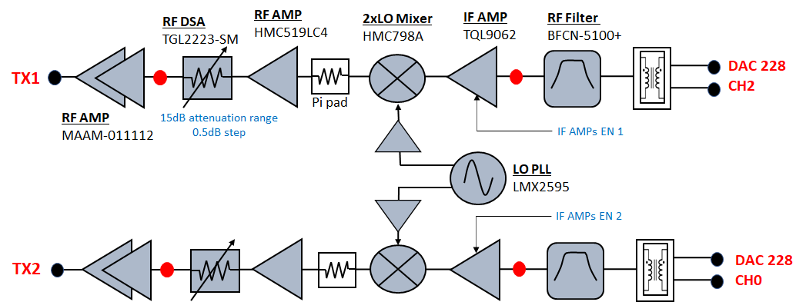
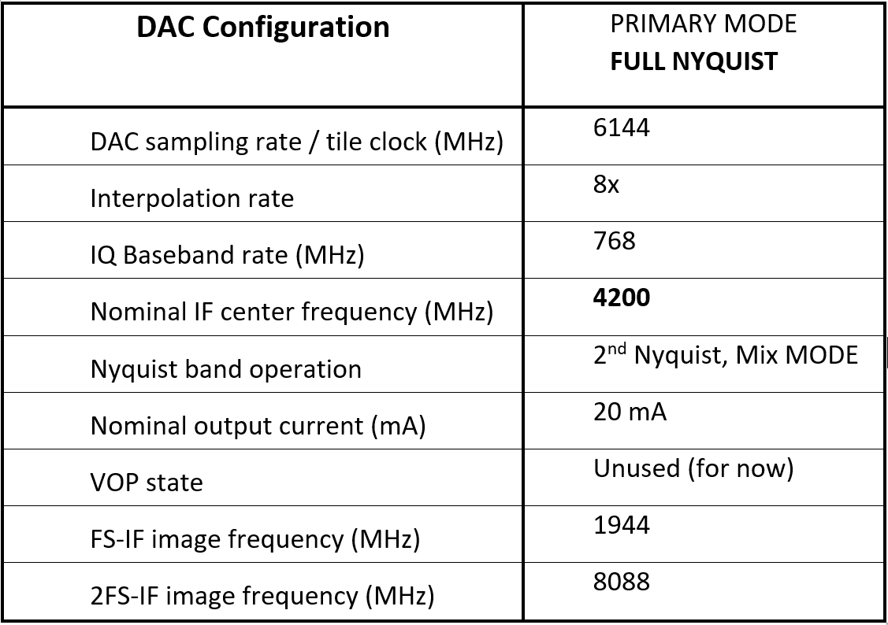
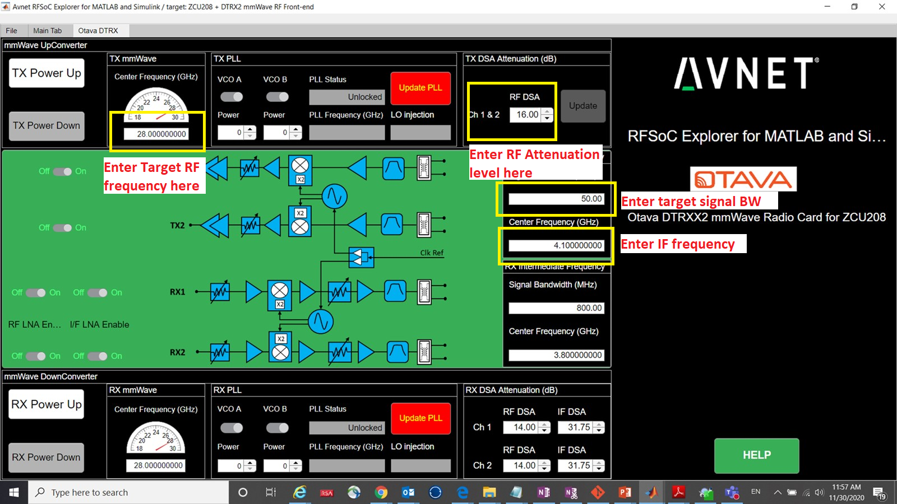
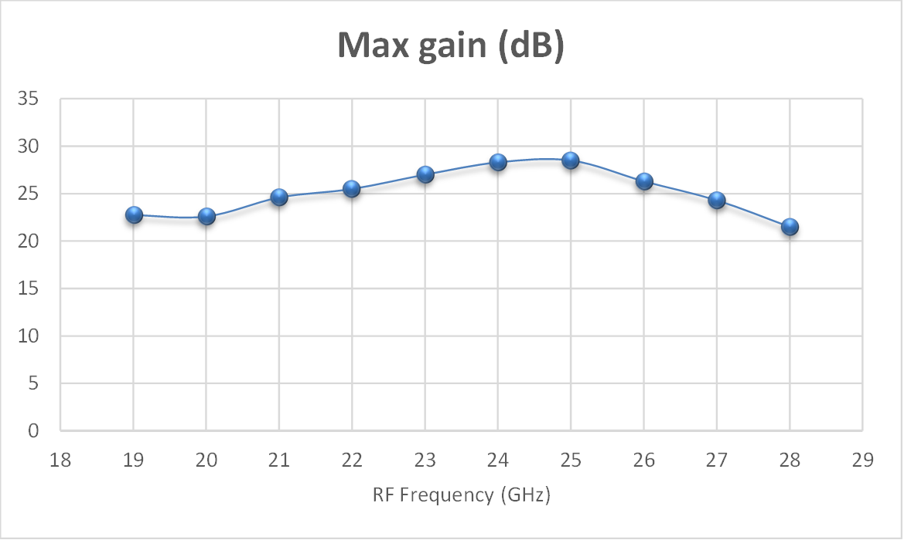
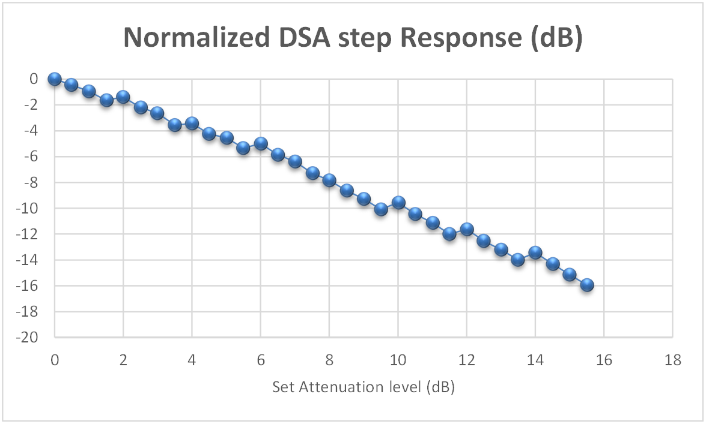

Transmitter Configuration and operation
=======================================

In this procedure, we will go over the steps to power up and program the ZCU208+DTRX2 radio kit in **transmit mode**. The DTRX2 card transmitters will be run in their default states, operating at a default RF modulation frequency of 25GHz.

The DTRX2 radio card signal chains
^^^^^^^^^^^^^^^^^^^^^^^^^^^^^^^^^^

The following diagram shows details of the TX signal chains of the DTRX2 card. 

The DTRX2 radio card implements 2 identical super-heterodyne TX chains, with their own dedicated PLL. 

The TX paths implement a wideband variable gain RF front-end with a 0.5dB step RF attenuator.

It is also possible to enable/disable each of these signal paths individually via software, by control of the amplifiers power-down pins. 

Please note the specific DAC tiles used on the RFSOC-Gen3 device shown in the diagram above. 

The RF band-select filter has been left out of this design to enable wideband RF coverage, but should be added to isolate the targeted sideband. 

The up-converter mixers are 2xLO sub-harmonic passive mixers. Therefore, TX LO PLL device only needs to provide an LO signal at half the required frequency range. 
It is also possible, via software, and within the specified range, to change the IF center frequency to target better pass-band response or mixing spurious performance, depending on the operating RF frequency.

Each of these signal chains also have provisions for various RF access points (shown as red dots on the block diagram). Hardware modification is required to route the RF signals to these test points, by moving an AC coupling capacitor. These test points are not populated by default.

Power-up steps via the RFSOC Explorer tool
^^^^^^^^^^^^^^^^^^^^^^^^^^^^^^^^^^^^^^^^^^

Before powering up the radio, set the spectrum analyzer center frequency to 25GHz to observe the signal transmitted. You may have to adjust the attenuation level on the analyzer.

From the RFSOC Explorer application, go to the “Otava DTRX” tab and hit the **“TX Power up”** button. This powers-up both TX channels and performs a default configuration of the 2 RF transmit channels.

::

  Insert picture of the RFSOC Explorer DTRX2 page

The average current drawn on the 12V supply should then be about 760mA. 

By defaults, both TX channels should be ON, and in the following state:

-	The default RF frequency is 25GHz and the TX PLL is programmed to an LO at 14.6GHz, for a default IF frequency of 4.2GHz.
-	The TX PLL visual lock indicator D2, on the radio card, should be lit (green LED)
-	Both TX channel 1 and channel 2 are enabled and powered up
-	Both Ch1 and Ch2 RF attenuators are set to **MAX attenuation** at -15.5dB

ZCU208 RFSOC DAC configuration and signal generation
----------------------------------------------------

How to configure and program the RFSOC DACs
^^^^^^^^^^^^^^^^^^^^^^^^^^^^^^^^^^^^^^^^^^^

#. Go back to the main tab of the RFSOC Explorer tool
#. Hit the ON button for the DAC tile 0 228 and wait for the initialization to complete (may take 30 seconds)
#. Then click on the highlighted DACs icons after the prompt, which brings you to the DAC configuration page, shown below.

.. image:: images_tx_setup/RFSOCX_RFSOC_DACs_cntrl_page.jpg

**Tile 0 DAC 2 drives the TX channel 1 of the DTRX2 card.**

**Tile 0 DAC 0 drives the TX channel 2 of the DTRX2 card.**

Let’s start with the DAC2 and configure it as shown in this table:

#. Check that the Tile clock (DAC sampling rate) is set to 6144MHz 
#. Click on the ON radio button on the right of DAC2
#. Enter the IF frequency of operation in the "Analog Fc(MHz)" field: here 4200MHz, which will also be used to set the RFSOC DUC NCO frequency based on the sampling rate  
#. Enter the interpolation rate: 8x

How to load and play a CW tone signal
^^^^^^^^^^^^^^^^^^^^^^^^^^^^^^^^^^^^^

At this point, the **Configure** button should highlighted in red, but before we hit it, let's set up the tool to transmit a CW tone.

In the **Signal Source** section, on the left of the page, set the sinewave frequency and its level relative to full scale. 
In this example, we’ll use a 10MHz baseband tone at -5dBFS

Now, hit the **Configure** button, then hit download, after the configuration is complete ("Configure button has turned green). 
You should see a display of the I and Q waveform in the graph below, on the GUI DAC page.

Note that you may also display the frequency domain response of the signal being loaded by toggling the **Time-Frequency** button above the graph.
This user interface also models the expected signal post DUC or post interpolating FIR filter: toggle the **Baseband-DUC** output button

With the DAC output IF frequency set at 4.2GHz, and the TX LO PLL running at 14.6GHz, the mixer generates 2 sidebands, including the wanted signal at 25GHz. Some amount of LO leakage also leaks out at 2x LO or 29.2GHz (2x multiplication inside the mixer LO chain).

The picture below, taken on a Rhode&Schwarz FSW43 spectrum analyzer, shows an 18GHz wide spectrum plot for a wanted signal at 26GHz, on an Rhode&Schwarz FSW43 spectrum analyzer. Because this radio has intentionnaly been designed to allow for a wide range of both IF and RF frequencies, the IF filter has limited selectivity, and the user needs to use an external RF pass-band filter to select the wanted sideband. 

.. image:: images_tx_setup/26G_TX_widespan.png

At any time here, from the **OTAVA DRTX** GUI tab, you may adjust the RF attenuation level, the target RF frequency, the IF frequency and target instantaneous bandwidth, as shown in the picture below. Remember that the TX paths attenuators are set to MAX attenuation after power up.

Note that the RFSOC Explorer GUI software automatically calculates the PLL output frequency based on the wanted RF frequency and IF frequency. 
You’ll need to hit the **“Update PLL”** button every time you change the RF, or the IF, or the target Bandwidth frequencies, to program the PLL accordingly.

On the DTRX2 card, the PLL circuit is configured to only run up to its maximum VCO fundamental frequency of <15.3GHz. Therefore, the mixer will operate in high-side injection until that threshold is reached and then switched to low-side injection. 
For an IF of 4.2GHz, this means:

-	High side injection up to an RF of 2*PLL_freq – IF = 2*15.3 – 4.2 =  26.4GHz

-	Low side injection beyond 26.4GHz

The user also has control of the LO drive level or output power, as a way to optimize for LO leakage and mixing spurs, especially at low RF frequencies.

Modulated signal generation 
^^^^^^^^^^^^^^^^^^^^^^^^^^^

The Signal Source section of the GUI, highlighted in yellow in the following picture, has a drop-down menu where you can select any .mat file to play thru the ZCU208, or choose one of the available Matlab Apps to define and configure any QAM or OFDM waveforms [select ‘Wireless Waveform’]. 

**Add picture of the drop-down waveforms options**

.. note::  **When loading and playing your own .mat complex signal vectors:**  The Xilinx RF Evaluation Tool programmable logic is designed to process 16-sample vectors between the PS and the PL. Therefore it is recommended to size the Matlab formated signals as multiple of 16 samples. This avoids automatic zero-padding by the RFSOC Explorer tool, which may show up as transition spurs in the frequency domain.

To **power down** the setup, follow these steps in this order:

#. Reduce the level of the signal played on the DAC page down to -100dBFS, then download
#. Go back to the DTRX page in the RFSOC Explorer GUI and hit **Power Down**
#. Turn OFF the DTRX2 card 12V power supply
#. Turn off the ZCU208 power switch

TX Channels gain budget vs. RF frequency
----------------------------------------

The TX channels are very wideband, covering almost 10GHz of spectrum. Not all the devices used in the RF chain perform equally over this entire bandwidth. As a result, the end-to-end gain of the TX chain varies as a function of the output mmW frequency. 
Also, as stated earlier, the PLL is only programmed to operate up to a maximum of 15.3GHz, which is the maximum VCO fundamental frequency. Beyond that point, the mixer LO injection needs to be switched to low-side injection, which occurs at and RF frequency >26.5GHz. 
The graph below shows the maximum gain expected vs. RF frequency:

Besides the available “VOP” gain control range available at DAC level (only available Q1 2021), the user has the ability to control the RF gain thru the on-board mmw digital step attenuator, by 0.5dB steps. The graph below shows the step response vs. set attenuation value.

